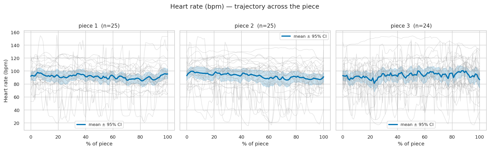
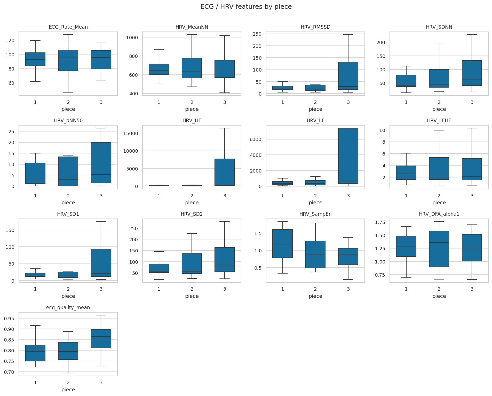

# 2inspire-neurokit-pipeline

Cardiorespiratory feature extraction from **Hexoskin** biosignals using
[**NeuroKit2**](https://neuropsychology.github.io/NeuroKit/). Given raw
single-lead ECG (256 Hz) and dual-channel respiration (thoracic + abdominal,
128 Hz), it produces whole-piece HRV/respiration features, continuous 1 Hz
trajectories, a raw-ECG-vs-device-RRI cross-check, and ready-made plots.

It was built for **2Inspire**, a study of musician physiology during live piano
performance (PI: Muneesh Tewari, University of Michigan): each participant plays
**three pieces**, and we ask how heart-rate variability and breathing behave
within and across pieces. The code itself is study-agnostic — point it at any
Hexoskin export described by a small JSON manifest and it runs.

> **TL;DR**
> ```bash
> pip install -r requirements.txt
> # put your Hexoskin export under source_data/Hexoskin/ (or pass --hexoskin-path)
> python neurokit_pipeline/run_all.py --participant all --session all
> python neurokit_pipeline/plots.py
> ```
> Outputs land in `results/neurokit_features/` and `plots/neurokit/`. Example
> outputs for the full 2Inspire cohort are already committed there.

---

## What it computes

**Per piece (whole-signal scalars)** — `results/neurokit_features/ecg_hrv_piece.csv`, `rsp_features_piece.csv`
- **HRV** from raw-ECG R-peaks via `nk.ecg_process` → `nk.hrv_time` / `nk.hrv_frequency` (Welch) / `nk.hrv_nonlinear`: time-domain (SDNN, RMSSD, pNN50…), frequency-domain (LF, HF, LF/HF…), nonlinear (SD1/SD2, DFA, sample/approximate entropy, …).
- **Respiratory sinus arrhythmia (RSA)** via `nk.hrv_rsa` (Porges–Bohrer, P2T, Gates), using the abdominal respiration channel resampled to the ECG grid.
- **Respiration** per channel via `nk.rsp_process(method="khodadad2018")`: rate / amplitude / RVT means & SDs, inhale/exhale slope & phase ratios, respiratory-rate variability (`nk.rsp_rrv`), and interval-related features (`nk.rsp_intervalrelated`, `NK_` prefix).
- **Quality control** columns: `ecg_quality_mean`, `pct_low_sqi`, `n_rate_outliers`, `pct_missing`, `n_outliers`.

**Continuous trajectories (1 Hz, resampled to a 0–100 % "% of piece" grid)** — `ecg_continuous_1hz.csv`, `rsp_continuous_1hz.csv`
- Instantaneous heart rate, rolling 30 s RMSSD, respiration rate & amplitude (per channel). The normalized grid lets pieces of different lengths be overlaid and averaged across participants.

**Cross-check** — `hrv_raw_vs_rri.csv`
- HRV from the noisy textile **raw ECG** vs HRV from the Hexoskin device's onboard **RR-interval** detection, with `delta_rmssd` / `delta_mean_hr`. See the [caveat](#-important-raw-ecg-vs-device-rri).

Full column dictionaries are in **[`docs/data_format.md`](docs/data_format.md)**; methodology and QC thresholds in **[`docs/methods.md`](docs/methods.md)**.

---

## Repository layout

```
2inspire-neurokit-pipeline/
├── neurokit_pipeline/            # the pipeline (8 self-contained modules)
│   ├── run_all.py                #   driver: loop participants × pieces → CSVs
│   ├── plots.py                  #   box-by-piece + trajectory figures
│   ├── signal_loader.py          #   HexLoader: manifest → folders → WAV/RRI
│   ├── process_ecg.py            #   nk.ecg_process wrapper
│   ├── process_rsp.py            #   nk.rsp_process wrapper (per channel)
│   ├── features_ecg.py           #   piece_hrv / hrv_from_rri / continuous_ecg
│   ├── features_rsp.py           #   piece_rsp / continuous_rsp
│   └── numpy_compat.py           #   np.trapz shim for NumPy 2.x + NeuroKit2 0.2.x
├── data/
│   ├── participants_anonymized.json   # manifest (P1..P29 → sensor session IDs)
│   └── Participants_DCS_anonymized.csv
├── results/neurokit_features/    # EXAMPLE outputs for the full 2Inspire cohort
├── plots/neurokit/               # EXAMPLE figures
├── docs/                         # data_format.md, methods.md
├── requirements.txt
├── LICENSE                       # MIT
└── CITATION.cff
```

> **Why `neurokit_pipeline/` and not `code/`?** A package directory literally named
> `code` shadows Python's standard-library `code` module and breaks downstream
> imports (e.g. seaborn → IPython → pdb). Naming it `neurokit_pipeline/` avoids
> that entirely, so you can run scripts from the repo root with no `PYTHONPATH`
> or `cwd` tricks.

---

## Installation

```bash
git clone https://github.com/adityabn6/2inspire-neurokit-pipeline.git
cd 2inspire-neurokit-pipeline
python -m venv .venv && source .venv/bin/activate   # optional
pip install -r requirements.txt
```

Requires **Python 3.11+**. NeuroKit2 is pinned to **0.2.13** (the feature code
targets the 0.2.x API). `numpy_compat.py` restores `np.trapz`, removed in
NumPy 2.0, so the pinned NeuroKit2 works on **NumPy 2.x** (tested on 2.3.5).

---

## Input data

The pipeline reads a Hexoskin export plus a JSON manifest that maps each
participant/piece to a Hexoskin session ID. **Raw signals are not shipped** with
this repo (large and identifiable); only the anonymized manifest is included.

Expected layout (default root `source_data/Hexoskin/`):

```
source_data/Hexoskin/
└── range_<hexoskin_id>-datatype_4096-1006/
    ├── record_<n>/
    │   ├── ECG_I.wav                    # single-lead ECG, 256 Hz
    │   ├── respiration_thoracic.wav     # 128 Hz
    │   └── respiration_abdominal.wav    # 128 Hz
    └── RR_interval.csv                  # device RR-intervals (seconds, last column)
```

`data/participants_anonymized.json` provides the mapping
(`sensor_data.hexoskin_sessions.session_{1,2,3}` → `<hexoskin_id>`). Provide your
data either by placing it under `source_data/Hexoskin/` (gitignored) or by
passing `--hexoskin-path /abs/path/to/Hexoskin`. Full schema in
[`docs/data_format.md`](docs/data_format.md).

**Sampling rates** are fixed and verified from the WAV headers: **ECG 256 Hz**,
**RSP 128 Hz**.

---

## Usage

Run from the repo root.

```bash
# Everybody, all three pieces (writes 5 CSVs + failures.md)
python neurokit_pipeline/run_all.py --participant all --session all

# A subset — ranges and lists are supported
python neurokit_pipeline/run_all.py --participant 1-5 --session 1,3

# See the participant→folder mapping without processing
python neurokit_pipeline/run_all.py --participant all --dry-run

# Point at data living elsewhere / write outputs elsewhere
python neurokit_pipeline/run_all.py \
    --hexoskin-path /data/2inspire/Hexoskin \
    --manifest data/participants_anonymized.json \
    --out-dir results/neurokit_features

# Plots (reads results/neurokit_features/, writes plots/neurokit/)
python neurokit_pipeline/plots.py
```

`run_all.py` flags: `--participant`, `--session` (`all` | `1-5` | `1,3,5`),
`--hexoskin-path`, `--manifest`, `--out-dir`, `--dry-run`.
`plots.py` flags: `--in-dir`, `--out-dir`.

---

## Outputs

| File | Rows (2Inspire) | Description |
|------|-----------------|-------------|
| `ecg_hrv_piece.csv` | 74 | One row / participant × piece. Whole-piece HRV from raw-ECG R-peaks + optional RSA + QC. |
| `rsp_features_piece.csv` | 148 | One row / participant × piece × channel (thoracic, abdominal). Rate/amplitude/RVT, slope & phase ratios, RRV, interval-related, QC. |
| `hrv_raw_vs_rri.csv` | 74 | Raw-ECG HRV vs device-RRI HRV, with `delta_rmssd` / `delta_mean_hr`. |
| `ecg_continuous_1hz.csv` | long | `feature ∈ {hr_bpm, hrv_rmssd}`, `t_pct` 0–100 % of piece, `value`. |
| `rsp_continuous_1hz.csv` | long | as above, plus `channel`; `feature ∈ {rsp_rate, rsp_amplitude}`. |
| `failures.md` | — | Skipped sessions and why (e.g. P17 has no ECG/RSP/RRI on disk). |

Plots in `plots/neurokit/`: `box_{ecg,rsp}_by_piece.png` (one box per piece) and
`traj_*.png` (per-participant trajectories on a 0–100 % piece axis with mean ± 95 % CI,
one panel per piece).

### Example figures

| HR trajectory across the piece | HRV / ECG features by piece |
|---|---|
|  |  |

---

## ⚠️ Important: raw-ECG vs device-RRI

Mean heart rate agrees almost exactly between the two sources (median |Δ| ≈ 0.06 bpm),
but for **~a third of sessions the raw-ECG RMSSD is wildly inflated** relative to
the device RR-interval (e.g. raw RMSSD 400–1000 ms vs device 100–500 ms).
Hexoskin's textile single-lead ECG is noisy; `nk.ecg_process` peak detection
inserts/misses beats, which barely moves mean HR but explodes successive-difference
HRV metrics (RMSSD, pNN50, SD1, HF).

**For beat-to-beat HRV, prefer the device-RRI path** (`hrv_raw_vs_rri.csv`, `rri_*`
columns); use raw-ECG HRV only where `delta_rmssd` is small and `ecg_quality_mean`
is high. Much of the piece-3 spread in the HRV box plots is driven by these noisy
sessions, not by a real piece effect. See [`docs/methods.md`](docs/methods.md).

---

## Known limitations

- **P17** has no ECG/RSP/RRI on disk for any piece (listed in `failures.md`).
- `session_1/2/3` denotes **piece order, not wall-clock order** — do not interpret
  within-session changes as time-on-task.
- Sub-second cross-modal synchronization (Hexoskin ↔ video ↔ motion) is not
  recoverable from the on-disk data; this pipeline treats each piece as a self-contained window.
- The raw-ECG HRV caveat above.

---

## Citation & acknowledgements

If you use this code or the bundled anonymized data, please cite it (see
[`CITATION.cff`](CITATION.cff)). The HRV/RSP feature logic is adapted from the
MOXIE Pipeline and built on [NeuroKit2](https://doi.org/10.3758/s13428-020-01516-y)
(Makowski et al., 2021). 2Inspire — PI Muneesh Tewari, University of Michigan.

## License

[MIT](LICENSE). Bundled data is anonymized (P1..P29, no PII); raw recordings are not distributed.
